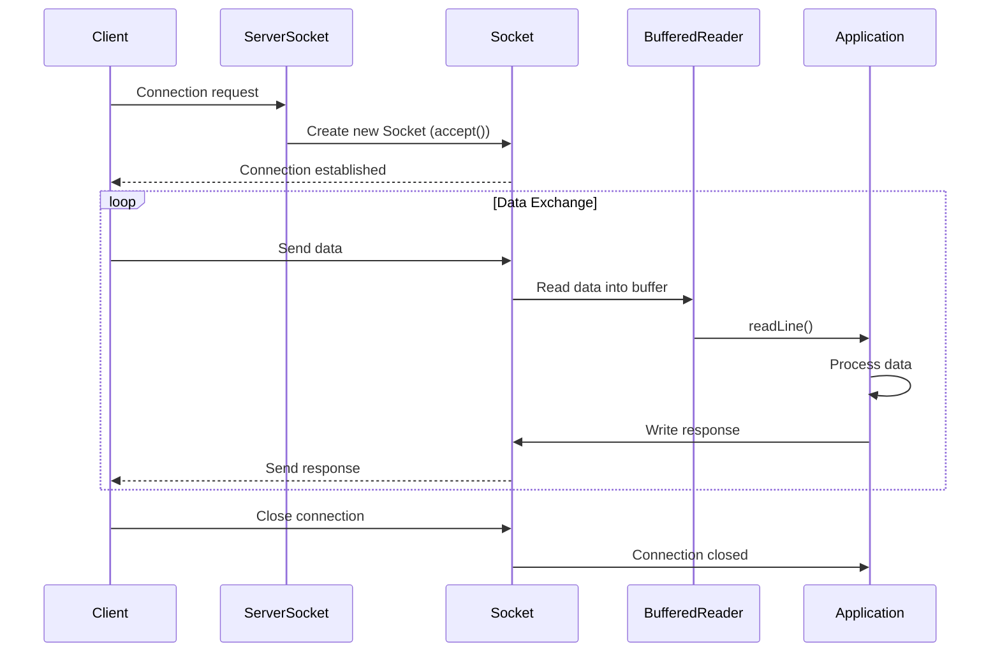

## TCP로 HTTP/1.1과 HTTP/2를 구현하는 서버

HTTP/1.1과 HTTP/2를 지원하는 TCP 기반 서버를 Java로 구현하는 것은 좋은 학습 프로젝트입니다. 단계별로 접근하면 더 쉽게 이해하고 구현할 수 있을 것입니다. 다음과 같은 단계로 나누어 진행할 수 있습니다:

기본 TCP 서버 구현
HTTP/1.1 지원 추가
HTTP/2 지원 추가

- [x] 기본 TCP 서버 구현

### TCP Connection and Data Exchange Flow

### TCP Server Vs HTTP/1.1

    1. 프로토콜 구조:
    기본 TCP 서버: 원시 바이트 스트림을 다룹니다. 데이터의 구조나 의미를 정의하지 않습니다.
    HTTP/1.1 서버: HTTP 프로토콜에 정의된 구조화된 메시지를 처리합니다 (요청 라인, 헤더, 본문 등).

    2. 요청/응답 형식:
    기본 TCP 서버: 요청과 응답의 형식이 정해져 있지 않습니다. 개발자가 직접 정의해야 합니다.
    HTTP/1.1 서버: GET, POST 등의 메서드, 상태 코드, 헤더 등 표준화된 형식을 따릅니다.

    3. 상태 관리:
    기본 TCP 서버: 상태를 유지하지 않습니다. 모든 상태 관리는 개발자가 구현해야 합니다.
    HTTP/1.1 서버: 쿠키를 통한 세션 관리, 캐시 제어 등의 메커니즘을 제공합니다.

    4. 연결 관리:
    기본 TCP 서버: 연결의 시작과 종료만 관리합니다.
    HTTP/1.1 서버: Keep-Alive, 연결 재사용 등의 개념을 지원합니다.

    5. 리소스 식별:
    기본 TCP 서버: 리소스 식별 메커니즘이 없습니다.
    HTTP/1.1 서버: URL을 통해 리소스를 식별합니다.

    6. 오류 처리:
    기본 TCP 서버: 오류 처리 메커니즘이 정의되어 있지 않습니다.
    HTTP/1.1 서버: 표준화된 상태 코드(예: 404, 500 등)를 사용하여 오류를 전달합니다.

    7. 확장성:
    기본 TCP 서버: 모든 확장 기능을 직접 구현해야 합니다.
    HTTP/1.1 서버: 헤더를 통해 다양한 기능을 확장할 수 있습니다.

    8. 보안:
    기본 TCP 서버: 보안 기능이 내장되어 있지 않습니다.
    HTTP/1.1 서버: HTTPS를 통한 암호화, 기본적인 인증 메커니즘 등을 지원합니다.

### TCP Server vs HTTP/1.1 Server Structure

```mermaid
graph TD
    subgraph "Basic TCP Server"
    A[TCP Connection] --> B[Raw Data Stream]
    B --> C[Custom Processing]
    C --> D[Raw Response]
    end

    subgraph "HTTP/1.1 Server"
    E[TCP Connection] --> F[HTTP Request Parsing]
    F --> G[Method & URL Routing]
    G --> H[Header Processing]
    H --> I[Body Processing]
    I --> J[Business Logic]
    J --> K[HTTP Response Formatting]
    K --> L[HTTP Response]
    end
```

- [x] HTTP/1.1 지원 추가 

## 멀티플렉싱 (Multiplexing):
    멀티플렉싱은 여러 개의 신호나 데이터 스트림을 하나의 통신 채널을 통해 동시에 전송하는 기술입니다. 네트워크 통신에서 이는 여러 요청과 응답을 동시에 처리할 수 있게 해줍니다.
    HTTP/1.1에서의 상황:

    연결 제한: HTTP/1.1은 기본적으로 하나의 TCP 연결에서 한 번에 하나의 요청만 처리할 수 있습니다.
    Head-of-Line Blocking: 첫 번째 요청이 완료되어야 두 번째 요청을 보낼 수 있습니다. 이를 "Head-of-Line Blocking"이라고 합니다.
    제한적인 해결책:
    
    여러 TCP 연결 사용: 브라우저들은 이 문제를 여러 개의 TCP 연결을 동시에 열어 해결하려 했습니다.
    파이프라이닝(Pipelining): 여러 요청을 연속해서 보내고 응답을 순서대로 받는 방식이지만, 구현이 복잡하고 많은 서버에서 지원하지 않았습니다.

    결론: HTTP/1.1에서는 진정한 의미의 멀티플렉싱이 불가능합니다.
    
    HTTP/2에서의 멀티플렉싱:
    HTTP/2는 이 문제를 해결하기 위해 설계되었습니다.
    
    스트림: HTTP/2는 하나의 TCP 연결 내에서 여러 개의 논리적 스트림을 생성할 수 있습니다.
    동시 요청/응답: 각 스트림은 독립적으로 요청과 응답을 처리할 수 있어, 여러 요청과 응답을 동시에 주고받을 수 있습니다.
    우선순위 지정: 스트림에 우선순위를 부여하여 중요한 리소스를 먼저 처리할 수 있습니다.
    Head-of-Line Blocking 해결: 한 요청이 지연되더라도 다른 요청/응답은 영향을 받지 않습니다.
    
    HTTP/1.1 vs HTTP/2 MultiplexingClick to open diagram
    이 다이어그램은 HTTP/1.1에서는 요청과 응답이 순차적으로 처리되는 반면, HTTP/2에서는 여러 요청과 응답이 동시에 처리될 수 있음을 보여줍니다.
    멀티플렉싱의 이점:
    
    성능 향상: 여러 요청을 동시에 처리하여 전체 페이지 로드 시간을 줄입니다.
    네트워크 효율성: 하나의 TCP 연결을 더 효율적으로 사용합니다.
    지연 감소: 개별 요청의 지연이 전체 성능에 미치는 영향을 줄입니다.
    
    결론적으로, HTTP/1.1은 진정한 의미의 멀티플렉싱을 지원하지 않지만, HTTP/2는 멀티플렉싱을 핵심 기능으로 제공하여 웹 성능을 크게 개선했습니다. 이는 현대 웹 애플리케이션의 복잡성과 리소스 요구사항이 증가함에 따라 매우 중요한 발전이 되었습니다.
    
- [ ] HTTP/2 지원 추가
